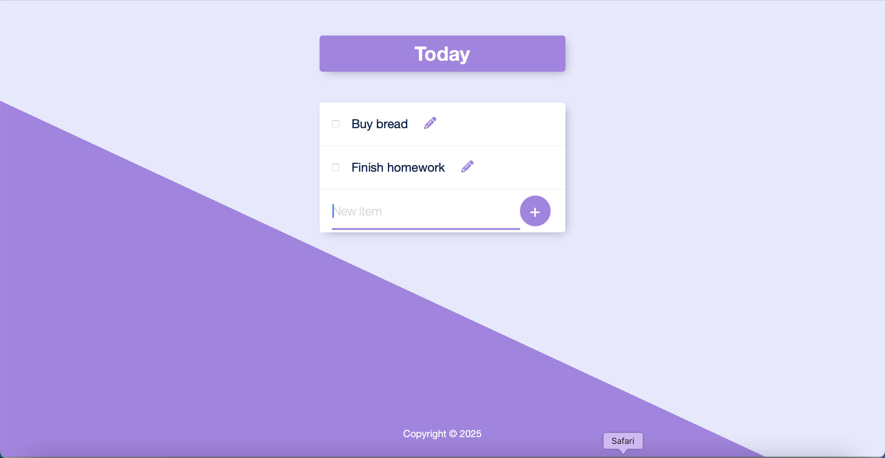

📝 Permalist

A Simple and Elegant To-Do List Web App

🌟 Overview

Permalist is a modern, responsive web application designed to help you manage your daily tasks effectively. Whether you're planning your day or organizing your to-do list, Permalist makes it easy and enjoyable to stay productive.

🎨 Features

Add Tasks: Create tasks effortlessly.
Edit & Delete: Modify or remove tasks with a single click.
Minimalist Design: A clean, distraction-free user interface.
Responsive Layout: Works seamlessly across devices.
Backend Integration: Data securely stored using PostgreSQL.
💻 Tech Stack

Frontend
HTML5, CSS3, JavaScript
Backend
Node.js, Express.js
Database
PostgreSQL
🚀 Getting Started

Prerequisites
Node.js and npm installed
PostgreSQL installed
Installation
Clone the repository
git clone https://github.com/yourusername/permalist.git
cd permalist
Install dependencies
npm install
Set up the database
Create a PostgreSQL database.
Add your credentials to a .env file using the provided .env.example template.
Start the server
npm start
Access the app
Open your browser and visit:
http://localhost:3000
📸 Screenshots

Task List View
🤝 Contributing

Contributions are welcome! If you have ideas for new features or improvements:

Fork the repository.
Create a feature branch:
git checkout -b feature-name
Commit your changes:
git commit -m "Add feature description"
Push to the branch:
git push origin feature-name
Open a pull request.
🛡️ License

This project is licensed under the MIT License.

🙌 Acknowledgments

Permalist was built with ❤️ to make everyday task management simple and stress-free.

